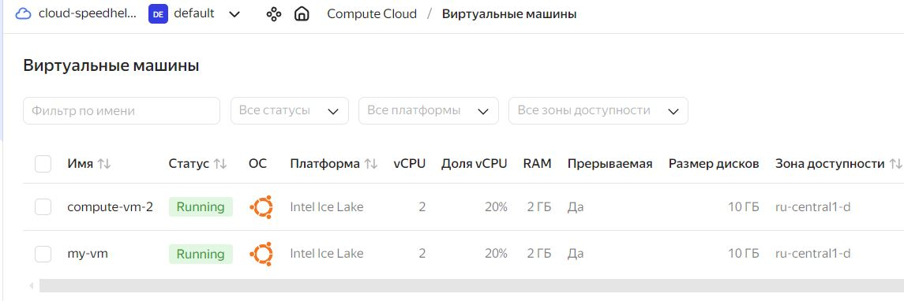
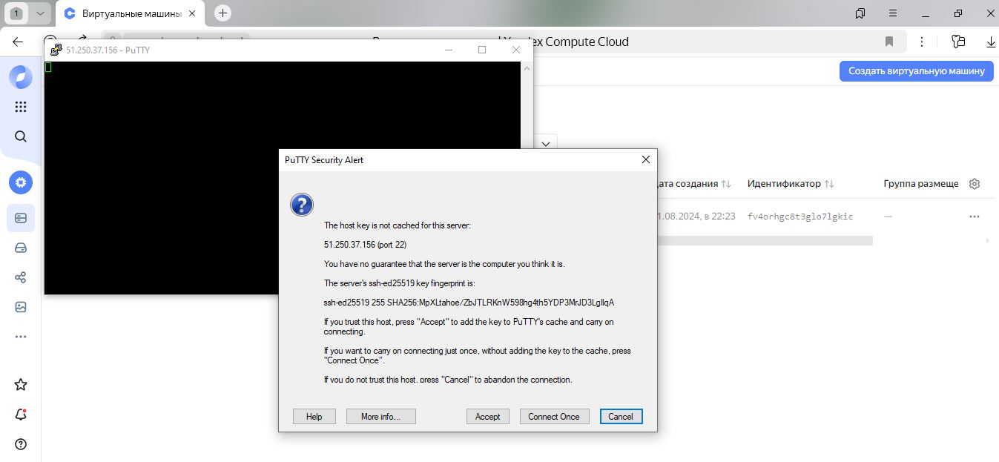
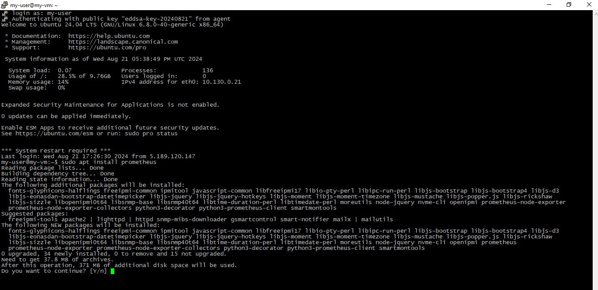
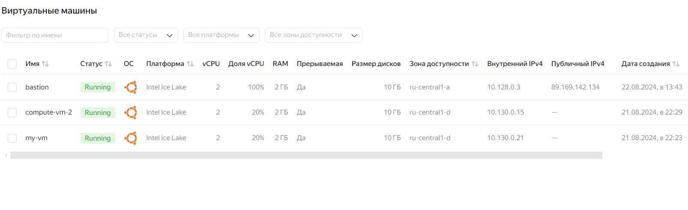
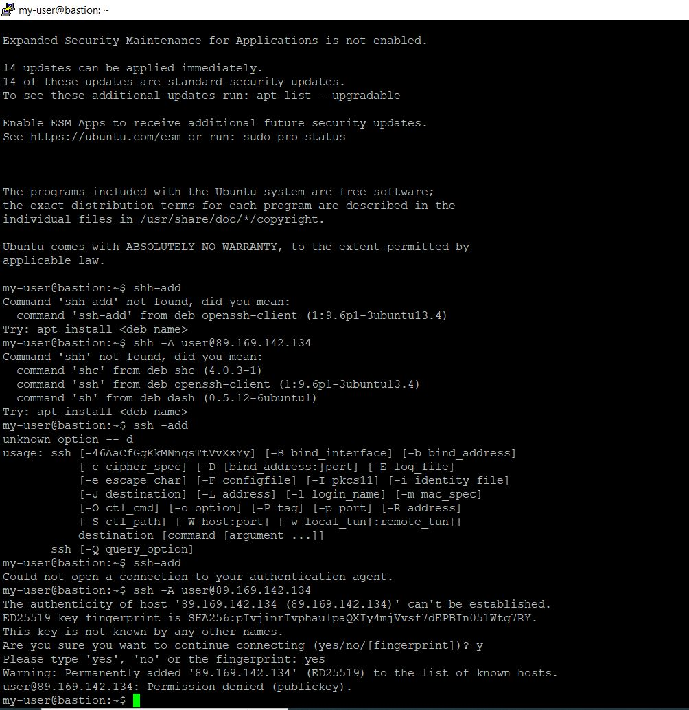
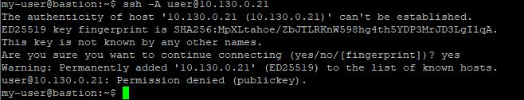
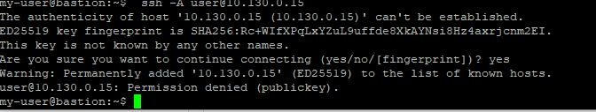
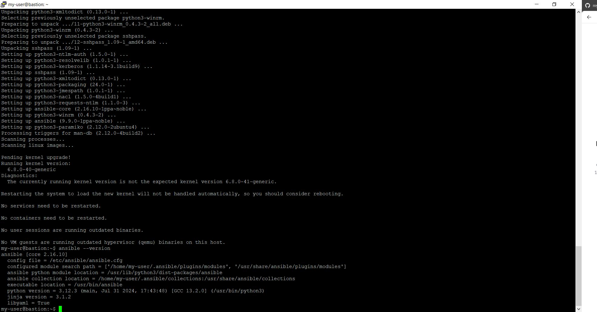
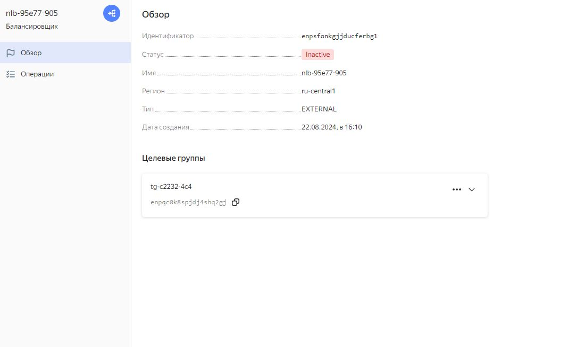

#  Дипломная работа по профессии «Системный администратор» Матвеева А.В

Содержание
==========
* [Задача](#Задача)
* [Инфраструктура](#Инфраструктура)
    * [Сайт](#Сайт)
    * [Мониторинг](#Мониторинг)
    * [Логи](#Логи)
    * [Сеть](#Сеть)
    * [Резервное копирование](#Резервное-копирование)
    * [Дополнительно](#Дополнительно)
* [Выполнение работы](#Выполнение-работы)
* [Критерии сдачи](#Критерии-сдачи)
* [Как правильно задавать вопросы дипломному руководителю](#Как-правильно-задавать-вопросы-дипломному-руководителю) 

---------
## Задача
Ключевая задача — разработать отказоустойчивую инфраструктуру для сайта, включающую мониторинг, сбор логов и резервное копирование основных данных. Инфраструктура должна размещаться в [Yandex Cloud](https://cloud.yandex.com/).

---
## Выполнение работы

Для подключения к виртуальным машинам и для генерации SSH ключав была скачена программа putty-64bit-0.81-installer.msi. Подключение происходило при помощи SSH- ключа. Так как ключ SSH был сгенерирован в этой программе, я его сохранил и защитил его паролем ( программа это позволяет делать при сохранении ключа в ОС машины) В процессе создания виртуальных машин в Яндекс клауде необходимо  указать SSH ключ в настройках. Для представления моих действии смотри видео. https://yandex.ru/video/preview/10543868946697369719
Сервер и инфраструктура были сделаны в  [Yandex Cloud](https://cloud.yandex.com/) Операционной системой для виртуальных машин выбрана Ubuntu 22.04 LTS.
Созданные ВМ:

Подключение к ВМ при помощи PUTTY.

Работа ВМ 1 и разворот на первой ВМ Prometheus.

Работа ВМ 2 и разворот на второй ВМ Prometheus.

Убераю публичный IP с созданных ВМ. Создаю Бастион - хост 

## Инфраструктура
Для развёртки инфраструктуры использую сервер bastion/
Пробрасываю им ключи доступа

Подключение доступа к первой и второй ВМ.

## Ansible
- Обновляем списки пакетов и устанавливаем пакет software-properties-common, необходимый для работы с репозиториями apt:

sudo apt update && sudo apt -y install software-properties-common
- Добавляем официальный репозиторий от Ansible:

sudo add-apt-repository --yes --update ppa:ansible/ansible
- Устанавливаем пакет ansible:

sudo apt -y install ansible
Когда установка завершится, необходимо убедиться, что она прошла корректно. Для этого выведем версию Ansible с помощью команды:

ansible --version
В первой строке вывода указана установленная версия — 2.16.10. Значит, установка прошла успешно.

Предварительная настройка Ansible
Прежде чем мы перейдем к использованию Ansible, необходимо настроить всего лишь один параметр, а именно выключить проверку ключей (host key verification) при подключении по протоколу SSH. Когда она включена, удаленный сервер просит подтвердить, что хост верный. При этом приходится вводить yes при подключении к каждому серверу. Для удобства выключим эту опцию. 

В Ansible присутствует основной конфигурационный файл с именем ansible.cfg, который по умолчанию располагается в /etc/ansible. 

## Сайт
Создайте две ВМ в разных зонах, установите на них сервер nginx, если его там нет. ОС и содержимое ВМ должно быть идентичным, это будут наши веб-сервера.

Виртуальные машины не должны обладать внешним Ip-адресом, те находится во внутренней сети. Доступ к ВМ по ssh через бастион-сервер. Доступ к web-порту ВМ через балансировщик yandex cloud.

Настройка балансировщика:

Создайте Target Group, включите в неё две созданных ВМ.

Создайте Backend Group, настройте backends на target group, ранее созданную. Настройте healthcheck на корень (/) и порт 80, протокол HTTP.

Создайте HTTP router. Путь укажите — /, backend group — созданную ранее.

Создайте Application load balancer для распределения трафика на веб-сервера, созданные ранее. Укажите HTTP router, созданный ранее, задайте listener тип auto, порт 80.

Протестируйте сайт curl -v <публичный IP балансера>:80

