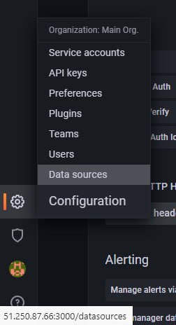

#  Дипломная работа по профессии «Системный администратор» Матвеева А.В

Содержание
==========
* [Задача](#Задача)
* [Инфраструктура](#Инфраструктура)
    * [Сайт](#Сайт)
    * [Мониторинг](#Мониторинг)
    * [Логи](#Логи)
    * [Сеть](#Сеть)
    * [Резервное копирование](#Резервное-копирование)
    * [Дополнительно](#Дополнительно)
* [Выполнение работы](#Выполнение-работы)
* [Критерии сдачи](#Критерии-сдачи)
* [Как правильно задавать вопросы дипломному руководителю](#Как-правильно-задавать-вопросы-дипломному-руководителю) 

---------
## Задача
Ключевая задача — разработать отказоустойчивую инфраструктуру для сайта, включающую мониторинг, сбор логов и резервное копирование основных данных. Инфраструктура должна размещаться в [Yandex Cloud](https://cloud.yandex.com/).

---
## Выполнение работы
Сервер и инфраструктура были сделаны в  [Yandex Cloud](https://cloud.yandex.com/) Операционной системой для виртуальных машин выбрана Ubuntu 22.04 LTS.
Созданные ВМ:


## Инфраструктура
Для развёртки инфраструктуры используйте Terraform и Ansible. 

---

Для развёртки использовался Terraform и Ansible.
Файлы используемые для развёртки должны находится в этом репозитории.


### Сайт
Создайте две ВМ в разных зонах, установите на них сервер nginx, если его там нет. ОС и содержимое ВМ должно быть идентичным, 
Создайте [Target Group](https://cloud.yandex.com/docs/application-load-balancer/concepts/target-group), включите в неё две созданных ВМ.
Создайте [Backend Group](https://cloud.yandex.com/docs/application-load-balancer/concepts/backend-group), настройте backends на target group, ранее созданную. Настройте healthcheck на корень (/) и порт 80, протокол HTTP.
Создайте [HTTP router](https://cloud.yandex.com/docs/application-load-balancer/concepts/http-router). Путь укажите — /, backend group — созданную ранее.
Создайте [Application load balancer](https://cloud.yandex.com/en/docs/application-load-balancer/) для распределения трафика на веб-сервера, созданные ранее. Укажите HTTP router, созданный ранее, задайте listener тип auto, порт 80.

---

Сайт доступен по ссылке 84.201.131.92
Требования отражены в файле main.tf

Протестируйте сайт
`curl -v <публичный IP балансера>:80` 
Вывод команды:


### Мониторинг
Создайте ВМ, разверните на ней Prometheus. На каждую ВМ из веб-серверов установите Node Exporter и [Nginx Log Exporter](https://github.com/martin-helmich/prometheus-nginxlog-exporter). Настройте Prometheus на сбор метрик с этих exporter.

Создайте ВМ, установите туда Grafana. Настройте её на взаимодействие с ранее развернутым Prometheus. Настройте дешборды с отображением метрик, минимальный набор — Utilization, Saturation, Errors для CPU, RAM, диски, сеть, http_response_count_total, http_response_size_bytes. Добавьте необходимые [tresholds](https://grafana.com/docs/grafana/latest/panels/thresholds/) на соответствующие графики.

---

ВМ создаётся при помощи terraform, Prometheus устанавливается при помощи playbook. 
Node Exporter тоже устанавливается через playbook. 
Но в моём решении есть пара нюансов которые, я уверен, можно реализовать более независимо от оператора. О нюансах ниже.

Для настройки работы Prometheus необходимо выполнить playbook2 и playbook3, после чего подключиться к prometheus и вручную ввести адреса ВМ с Node Exporter, затем перезапустить сервис ( и обязательно проверить его статус). После чего prometheus начнёт собирать нужную информацию.
Порядок настройки:
1) Подключаемся по ssh к ВМ.
2) Переходим в /etc/prometheus
3) Редактируем файл prometheus.yml
4) Перезапускаем сервис (и обязательно проверяем его статус после рестарта)


Grafana - здесь тоже есть пара нюансов. При помощи playbook4 мы скачиваем deb пакет на ВМ. А далее необходимо вручную его установить. Работать руками приходится потому, что на момент написания работы, я столкнулся с некоторыми ошибками при установке Grafana через playbook. Меньше слов, больше дела. Ниже представленны операции для настройки grafana
1) Сначала запускаем playbook4 
2) Подключаемся по ssh к ВМ
3) Пробуем выполнить установку deb пакета. 
4) dpkg -i grafana_9.2.4_amd64.deb
5) После получения ошибки выполняем следующие команды
6) apt update
7) apt --fix-broken install
8) Повторяем попытку установить Grafana. 
9) dpkg -i grafana_9.2.4_amd64.deb
10) После успешной установки можно переходить к настройкам

http://51.250.87.66:3000/?orgId=1
login:   admin
pass:    Solomon22_1




Для отображения инфомрации создаём ряд метрик из node_exporter и из Node Exporter и Nginx Log Exporter.
Конфигурация последнего была изменена т.к. сразу после установки он неправильно парсил логи.
Конфигурация Nginx Log Exporter.

```nginx
listen {
  port = 4040
}

namespace "nginx" {
  source = {
    files = [
      "/var/log/nginx/access.log"
    ]
  }

   format = "$remote_addr - $remote_user [$time_local] \"$request\" $status $body_bytes_sent \"$http_referer\" \"$http_user_agent\""
  labels {
    app = "default"
  }
}
```


### Логи
Cоздайте ВМ, разверните на ней Elasticsearch. Установите filebeat в ВМ к веб-серверам, настройте на отправку access.log, error.log nginx в Elasticsearch.

Создайте ВМ, разверните на ней Kibana, сконфигурируйте соединение с Elasticsearch.

---

Установка происходит при помощи playbook5, 6, 7.
Т.к. через Ansible вможно редактировать файлы, но это довольно трудоёмкий процесс - я решил подготовить конфиги на машине оператора, а потом просто передать их на ВМ.
И для корректной работы перед использованием playbook6, 7 - необходимо поменять ip адреса в файлах kibana.yml и filebeat.yml на те, которые подходят вам. Сами файлы находятся в дирректории elasticsearch_files

http://51.250.6.17:5601/app/infra#/logs/stream?_g=()&flyoutOptions=(flyoutId:!n,flyoutVisibility:hidden,surroundingLogsId:!n)&logPosition=(position:(tiebreaker:0,time:1685217539807),streamLive:!f)

kibana.yml


filebeat.yml


### Сеть
Разверните один VPC. Сервера web, Prometheus, Elasticsearch поместите в приватные подсети. Сервера Grafana, Kibana, application load balancer определите в публичную подсеть.

Настройте [Security Groups](https://cloud.yandex.com/docs/vpc/concepts/security-groups) соответствующих сервисов на входящий трафик только к нужным портам.

Настройте ВМ с публичным адресом, в которой будет открыт только один порт — ssh. Настройте все security groups на разрешение входящего ssh из этой security group. Эта вм будет реализовывать концепцию bastion host. Потом можно будет подключаться по ssh ко всем хостам через этот хост.


### Резервное копирование
Создайте snapshot дисков всех ВМ. Ограничьте время жизни snaphot в неделю. Сами snaphot настройте на ежедневное копирование.


